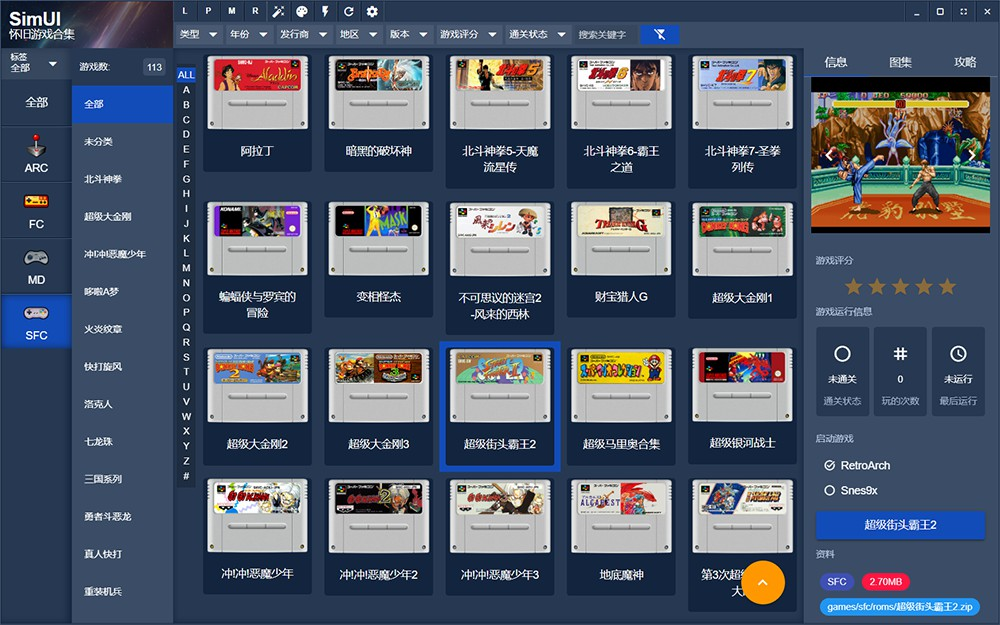

**SimUI Pulsar 是由热爱街机文化的玩家开发的免费专业游戏ROM管理软件。**

**SimUI Pulsar是SimUI的重构版本。**

## 软件介绍

我们希望打造极致的产品，融入工匠精神，不断探索每一种更好的可能。SIMUI以资料收集和分享为圆心，为玩家打造更具品质的模拟游戏图书馆软件。

软件支持自由添加游戏平台、支持多游戏模拟器、多游戏目录；

支持ROM别名，ROM子游戏、支持游戏资料定义；

支持多种展示图显示、支持gif动画、支持游戏音乐、支持视频；

支持游戏简介、游戏攻略，支持富文本显示；

支持自定义皮肤、支持多语言、支持Lua脚本注入；

软件懒加载机制、软件改名、下载缩略图、自定义实用工具等诸多功能。




&nbsp;
## 软件地址

[www.simui.net/](http://www.simui.net/)


## 技术栈

GOLANG + wails + vue3 + quasar

## 目录说明

```
build 编译目录
components 业务组件
config 配置相关
constant 常量定义
controller （前端调用入口）
db 数据库dao
frontend 前端代码
modules 业务模块
request 结构体定义
utils  公共库
```


