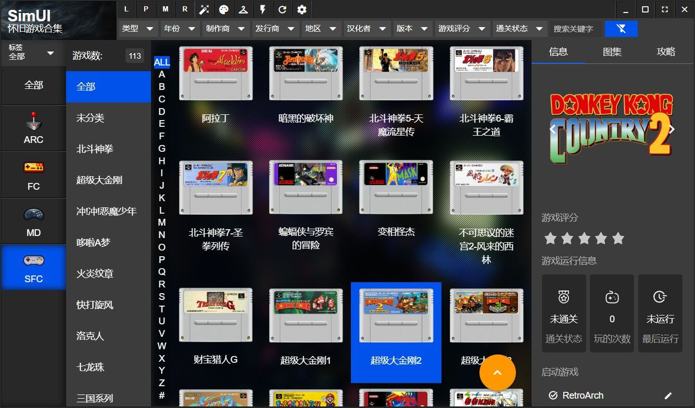
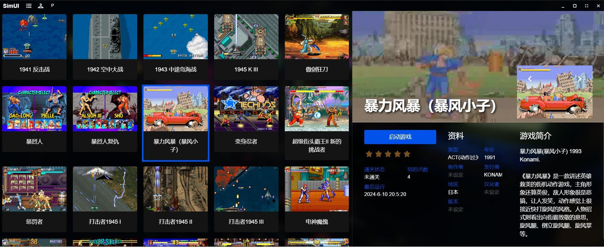
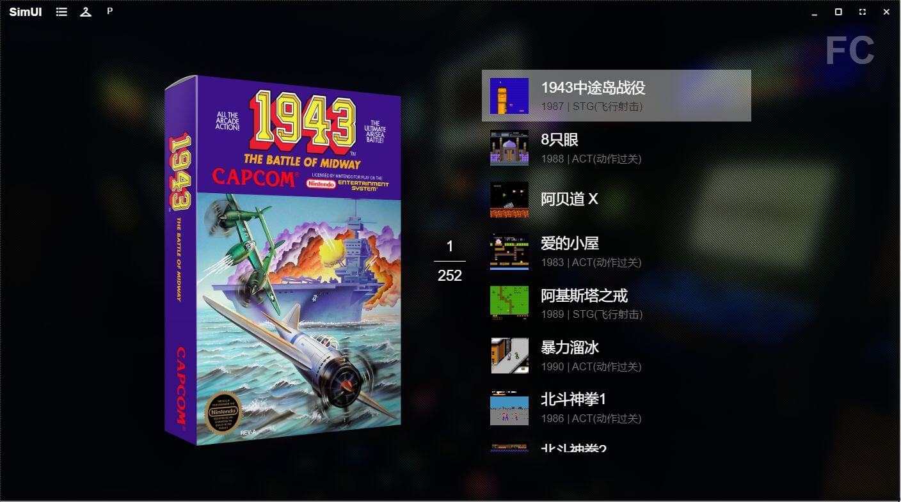

[[简体中文]](README.md)

**SimUI Pulsar is a free, professional game ROM management software developed by players who love arcade culture. It is a restructured version of SimUI.**

## Software Introduction

We aim to create the ultimate product, incorporating a craftsman spirit, and continually exploring every better possibility. SIMUI, centered around data collection and sharing, is designed to provide players with a high-quality emulated game library software.

The software supports the addition of game platforms freely, supports multiple game emulators, and multiple game directories;

Supports ROM aliases, ROM sub-games, and game metadata definitions;

Supports various display images, GIF animations, game music, and videos;

Supports game descriptions and guides, with rich text display;

Supports custom skins and multiple languages;

Supports gamepads and joysticks;

The software features lazy loading, renaming, thumbnail downloads, custom utilities, and many other functions.







&nbsp;

## Software Website

[www.simui.net/](http://www.simui.net/)

## Technology Stack

GOLANG + wails + vue3 + quasar

## Directory Explanation

```
build      Compilation directory
components Business components
config     Configuration
constant   Constant definitions
controller (Frontend call entry)
db         Database DAO
frontend   Frontend code
modules    Business modules
request    Structure definitions
utils      Common libraries
```

## Related Technical Documentation

wails: https://wails.io/docs/introduction/

vue3: https://vuejs.org/guide/introduction.html

quasar: https://quasar.dev/docs
